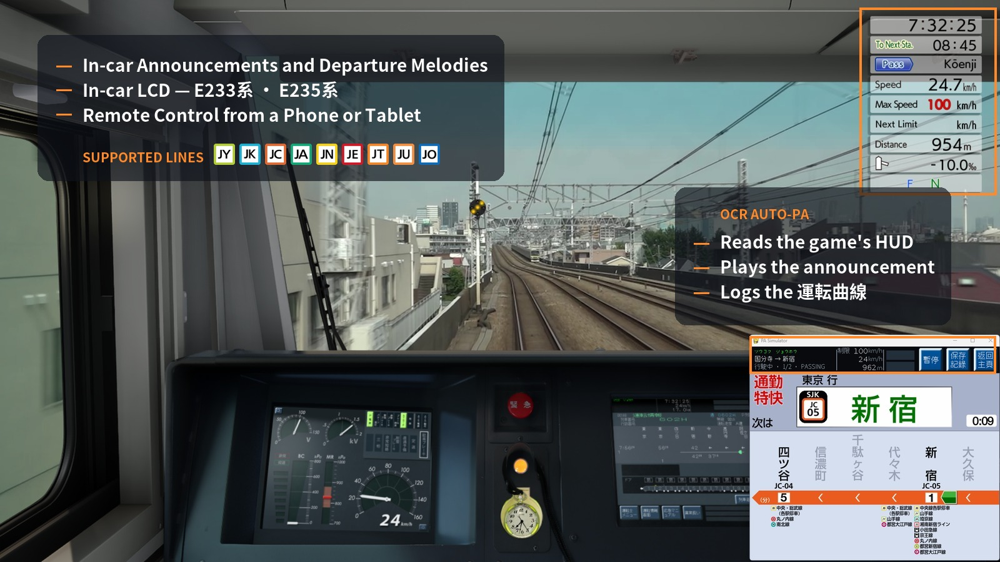
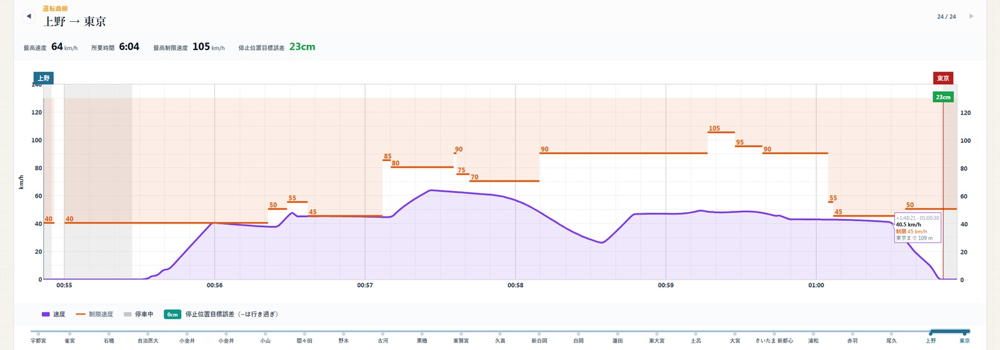
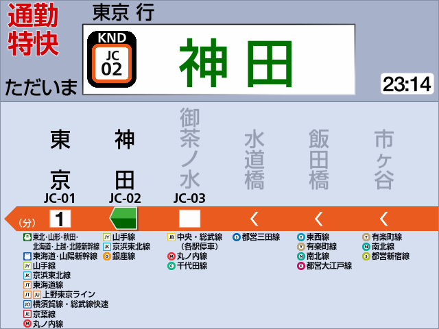
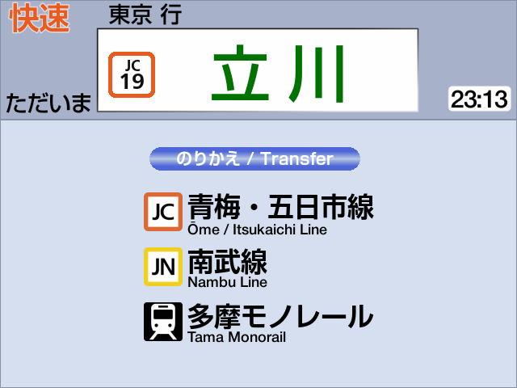
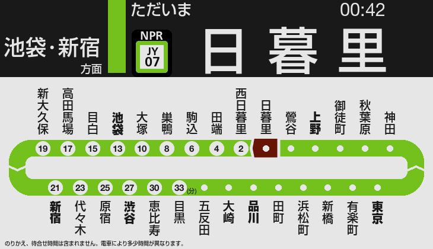
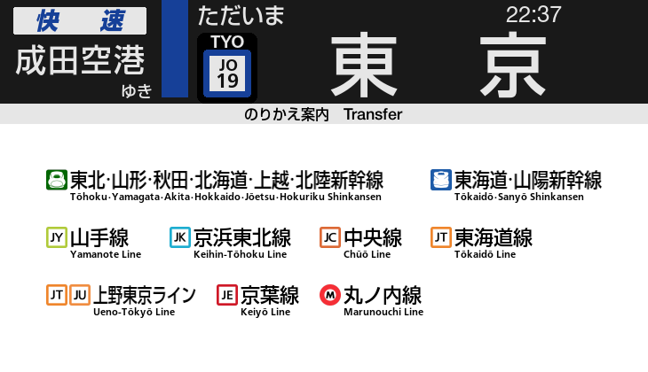

# JRE-PA-Simulator

Japanese Train PA (Public Address) Simulator — JR East style train announcements with visual LCD display.

**[繁體中文](docs/README.zh-HK.md)** · **[简体中文](docs/README.zh-CN.md)** · **[Supported Routes](docs/ROUTES.md)**

---

## Features

Speed against the limit, time per leg, and how close to the mark you stopped.

---

## Screenshots

###  E233-0 — 中央線快速

| 6-station view | Transfer info |
|---|---|
|  |  |

###  E235-0 — 山手線

| 5-station view | Full-route view |
|---|---|
|  |  |

###  E235-1000 — 総武快速線

| Skip animation | Full-route view | Transfer info |
|---|---|---|
|  |  |  |

### Setup

| PA settings | Diagram select |
|---|---|
|  |  |

---

## Usage

Pick a line and diagram on the setup screen, press Enter to start.

**Automatic or manual.** The simulator can read the game's own on-screen display and play each announcement at the right moment — press **OCR Auto Start** on the PA-setting screen, then just drive. It needs the game running on your primary monitor at a supported resolution. This is how most people run it.

**Driving manually, Page Down drives everything.** The train doesn't advance on a timer — every announcement and every stop happens when you press Page Down.

| Key | Action |
|-----|--------|
| Page Down | Next PA announcement / advance to next stop |
| Page Up | Play departure melody (press again to skip to closing-door announcement) |
| End | Pause |
| ESC | Quit |

A **yellow square** on the display means this stop has more than one announcement — keep pressing Page Down to play them all before arriving at the station.

The upper LCD cycles between Japanese, Furigana, and English. Major JR East interchange stations also show their 3-letter Roman code (AKB, TYO, SJK…) above the line-code square.

---

## Planned Features

- More lines and diagrams
- E233-1000, -5000, -7000, -8000
- Transfer info at every station
- More screen shapes

---

## Credits

Line symbols and operator logos come from [Wikimedia Commons](https://commons.wikimedia.org/wiki/Category:Rapid_transit_icons_of_Japan) — thanks to the contributors who drew and maintain them, and in particular to Carnby, Perhelion, KANAO22 and 東京都交通局 for the shinkansen and Tokyo Sakura Tram marks.

The announcements and departure melodies were recorded at the platform and published by individual railway enthusiasts. The Utsunomiya Line and Chūō 602H are the ones whose sources were written down as the work happened — thanks to East Railway Redwing for both of 602H's, and to 全国駅メロチャンネル, ちいぼす, East Railway Redwing and µ'wing, who between them account for most of it, and to 70-000 SHINANO, Kent_K, SAGAMI-LINE さがみせん, Ueno-Tokyo Line, ケヨポコ チャンネル short, ハマ音鉄, 下今市, 京葉ラビット, 武蔵野快速, 関石ライン / Kamishi Line and 音鉄DK. The recordists of the earlier lines are owed the same thanks; their sources were not recorded at the time.

Full credits and asset details: [THIRD-PARTY.md](THIRD-PARTY.md).
