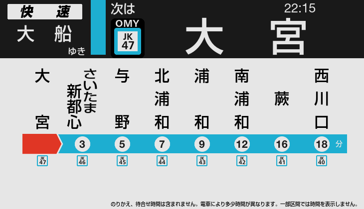
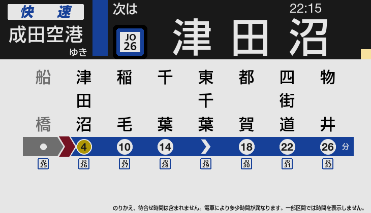
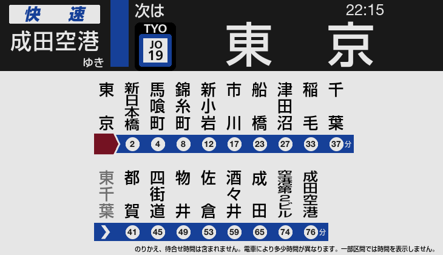

# JRE-PA-Simulator

JR 東日本風格列車廣播與車內 LCD 顯示模擬器。

**[English](README.md)** · **[简体中文](README.zh-CN.md)** · **[對應路線](ROUTES.md)**

---

## 截圖

| 精簡顯示 | 通過站動畫 | 全路線顯示 |
|---|---|---|
|  |  |  |

---

## 下載

前往 [**Releases**](https://github.com/ksleungac/pids-jre-simulator/releases/latest):

- **`JRE-PA-Simulator-<version>-distribution.zip`** — 完整版本(包含 exe、字型、資料與音檔,約 629 MB)。解壓後執行 `JRE-PA-Simulator.exe`。
- **`JRE-PA-Simulator.exe`** — 獨立執行檔,如你已擁有 `fonts/`、`data/` 與 `audio/` 資料夾。

---

## 使用方法

在選擇畫面用方向鍵揀選路線和班次,按 Enter 開始。

**所有操作經 Page Down**。程式不會自動跳去下一站 — 播放廣播、切換到下一站都需要人手按 Page Down。

| 按鍵 | 功能 |
|------|------|
| Page Down | 下一則廣播／前往下一站 |
| Page Up | 播放發車音樂(播放途中再按一次可跳至關門廣播) |
| End | 暫停 |
| ESC | 離開 |

畫面上出現**黃色方格**代表該站有多段廣播 — 請在到站之前按 Page Down 播完所有廣播。

上方 LCD 會循環切換日文、假名、英文顯示。主要 JR 東日本轉車站也會在路線代碼方格之上,顯示 3 個英文字母的車站代碼(AKB、TYO、SJK…)。

---

## 計劃中的功能

- 更多路線及班次
- 更多 LCD 樣式(E233-0 番台、E231 系列等)
- 強化下部 LCD
