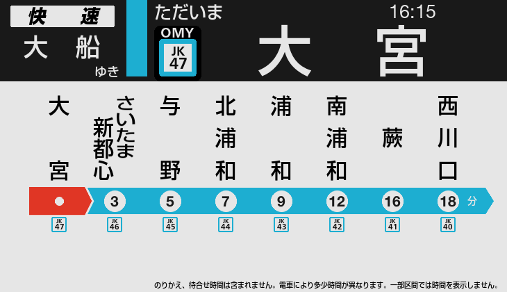
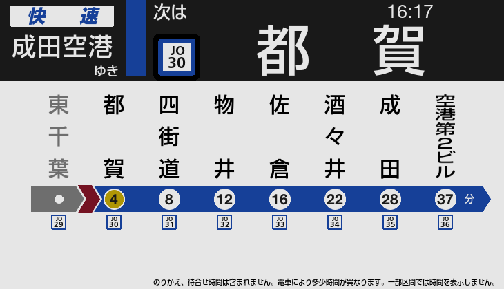
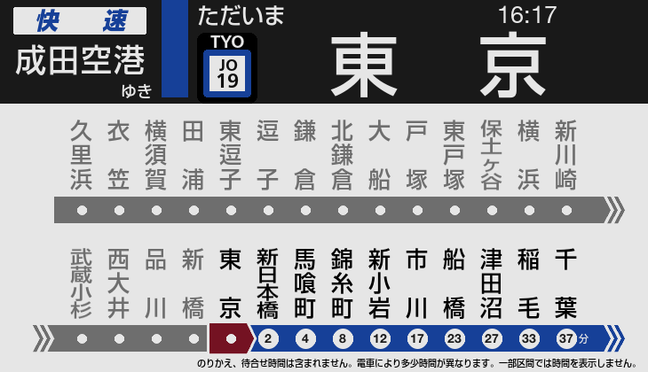
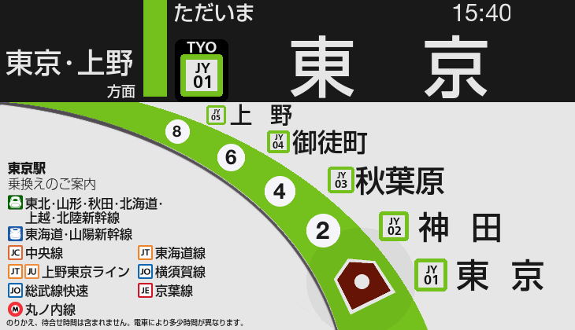
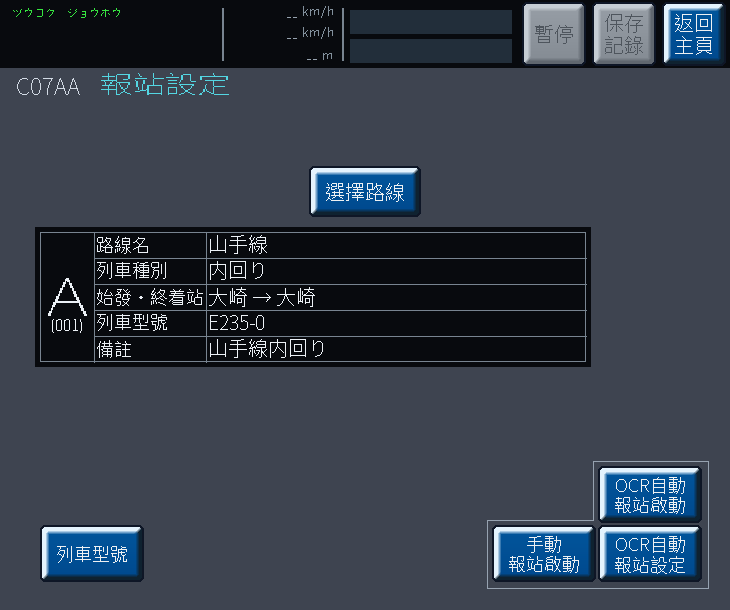
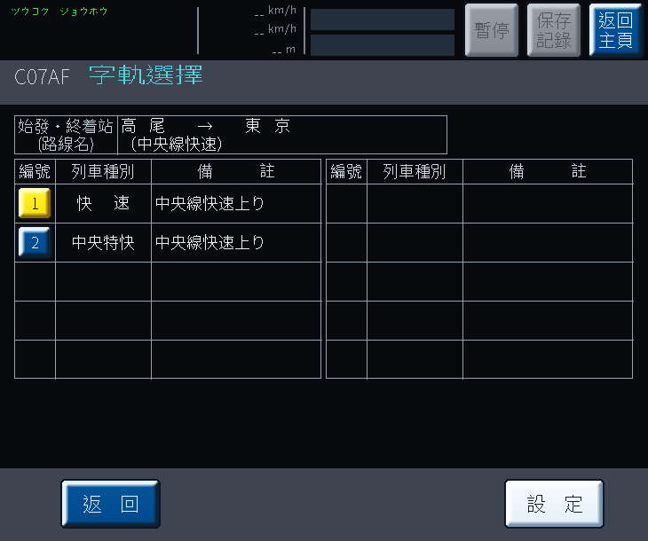

# JRE-PA-Simulator

JR 東日本風格列車廣播與車內 LCD 顯示模擬器。

**[English](README.md)** · **[简体中文](README.zh-CN.md)** · **[對應路線](ROUTES.md)**

---

## 截圖

| 精簡顯示 | 通過站動畫 | 全路線顯示 |
|---|---|---|
|  |  |  |

| 轉車資訊（東京） | 轉車資訊（新宿） | 山手線 5 站顯示（E235-0） |
|---|---|---|
|  |  |  |

| 報站設定 | 班次選擇 |
|---|---|
|  |  |

---

## 下載

前往 [**Releases**](https://github.com/ksleungac/pids-jre-simulator/releases/latest):

- **`JRE-PA-Simulator-<version>-distribution.zip`** — 完整版本（包含 exe、字型、資料與音檔，約 629 MB）。解壓後執行 `JRE-PA-Simulator.exe`。
- **`JRE-PA-Simulator.exe`** — 獨立執行檔，如你已擁有 `fonts/`、`data/` 與 `audio/` 資料夾。

---

## 使用方法

在選擇畫面揀選路線和班次，按 Enter 開始。

**自動或人手操作。** 程式可以讀取遊戲畫面上的資訊，在適當時候播放每一則廣播 — 在報站設定頁按 **OCR自動報站啟動**，之後專心駕駛就可以。需要遊戲在主螢幕上執行，解像度亦要在支援範圍內。大部分用家都是這樣用。

**人手操作時，所有操作經 Page Down**。程式不會自動跳去下一站 — 播放廣播、切換到下一站都需要人手按 Page Down。

| 按鍵 | 功能 |
|------|------|
| Page Down | 下一則廣播／前往下一站 |
| Page Up | 播放發車音樂（播放途中再按一次可跳至關門廣播） |
| End | 暫停 |
| ESC | 離開 |

畫面上出現**黃色方格**代表該站有多段廣播 — 請在到站之前按 Page Down 播完所有廣播。

上方 LCD 會循環切換日文、假名、英文顯示。主要 JR 東日本轉車站也會在路線代碼方格之上，顯示 3 個英文字母的車站代碼（AKB、TYO、SJK…）。

---

## 計劃中的功能

- 更多路線及班次
- 更多 LCD 樣式（E233-0 番台、E231 系列等）
- 強化下部 LCD
- 支援更多螢幕尺寸及畫面比例

---

## 鳴謝

路線及營運商標誌均取自 [Wikimedia Commons](https://commons.wikimedia.org/wiki/Category:Rapid_transit_icons_of_Japan)，感謝繪製及維護這些圖示的貢獻者，其中新幹線與東京櫻花電車標誌來自 Carnby、Perhelion、KANAO22 及東京都交通局。

完整鳴謝及素材資料：[THIRD-PARTY.md](THIRD-PARTY.md)。
