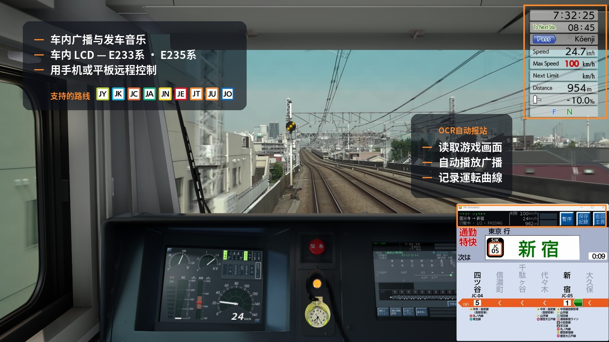

# JRE-PA-Simulator

JR 东日本风格列车广播与车内 LCD 显示模拟器。

**[English](../README.md)** · **[繁體中文](README.zh-HK.md)** · **[支持的路线](ROUTES.md)**

---

## 功能

速度对比限速、每段行车时间,以及停车位置差多少。

---

## 截图

###  E233-0 — 中央線快速

| 6 站显示 | 换乘信息 |
|---|---|
|  |  |

###  E235-0 — 山手線

| 5 站显示 | 全路线显示 |
|---|---|
|  |  |

###  E235-1000 — 総武快速線

| 通过站动画 | 全路线显示 | 换乘信息 |
|---|---|---|
|  |  |  |

### 设置界面

| 报站设置 | 车次选择 |
|---|---|
|  |  |

---

## 使用方法

在选择界面选择路线和车次,按 Enter 开始。

**自动或手动操作。** 程序可以读取游戏画面上的信息,在适当的时候播放每一段广播 — 在报站设置页按 **OCR自动报站启动**,之后专心驾驶即可。需要游戏在主显示器上运行,分辨率也要在支持范围内。大部分用户都是这样用。

**手动操作时,所有操作通过 Page Down**。程序不会自动跳到下一站 — 播放广播、切换到下一站都需要手动按 Page Down。

| 按键 | 功能 |
|------|------|
| Page Down | 下一段广播／前往下一站 |
| Page Up | 播放发车音乐(播放途中再按一次可跳至关门广播) |
| End | 暂停 |
| ESC | 退出 |

画面上出现**黄色方块**表示该站有多段广播 — 请在到站之前按 Page Down 播完所有广播。

顶部 LCD 会循环切换日文、假名、英文显示。主要 JR 东日本换乘站也会在线路代码方块上方,显示 3 个字母的车站代码(AKB、TYO、SJK…)。

---

## 计划中的功能

- 更多线路及车次
- E233-1000、-5000、-7000、-8000
- 全站换乘信息
- 更多屏幕比例

---

## 鸣谢

线路及运营商标志均取自 [Wikimedia Commons](https://commons.wikimedia.org/wiki/Category:Rapid_transit_icons_of_Japan)，感谢绘制及维护这些图标的贡献者，其中新干线与东京樱花电车标志来自 Carnby、Perhelion、KANAO22 及东京都交通局。

广播及发车音乐由铁道爱好者在站台录制并公开发布。宇都宫线和中央线 602H 是在制作当时已记录来源的部分,602H 两段录音均来自 East Railway Redwing;宇都宫线方面感谢 全国駅メロチャンネル、ちいぼす、East Railway Redwing 及 µ'wing，其中大部分素材出自四位之手，也感谢 70-000 SHINANO、Kent_K、SAGAMI-LINE さがみせん、Ueno-Tokyo Line、ケヨポコ チャンネル short、ハマ音鉄、下今市、京葉ラビット、武蔵野快速、関石ライン / Kamishi Line 及 音鉄DK。其余线路的录音者同样值得道谢，只是当时未有记录来源。

完整鸣谢及素材资料：[THIRD-PARTY.md](../THIRD-PARTY.md)。
