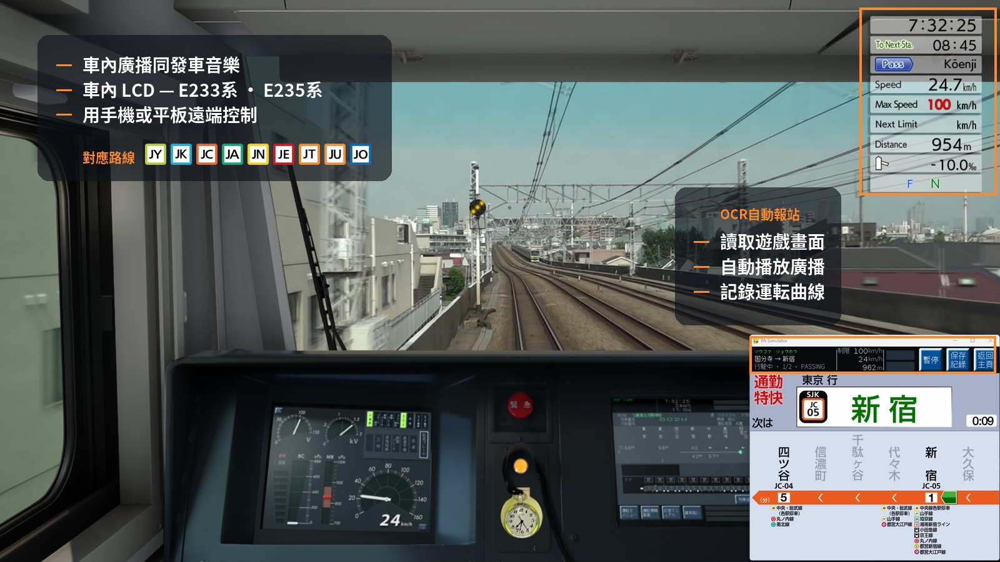

# JRE-PA-Simulator

JR 東日本風格列車廣播與車內 LCD 顯示模擬器。

**[English](../README.md)** · **[简体中文](README.zh-CN.md)** · **[對應路線](ROUTES.md)**

---

## 功能

速度對比速度限制、每段行車時間，同埋停車位置差幾多。

---

## 截圖

###  E233-0 — 中央線快速

| 6 站顯示 | 轉車資訊 |
|---|---|
|  |  |

###  E235-0 — 山手線

| 5 站顯示 | 全路線顯示 |
|---|---|
|  |  |

###  E235-1000 — 総武快速線

| 通過站動畫 | 全路線顯示 | 轉車資訊 |
|---|---|---|
|  |  |  |

### 設定畫面

| 報站設定 | 班次選擇 |
|---|---|
|  |  |

---

## 使用方法

在選擇畫面揀選路線和班次，按 Enter 開始。

**自動或人手操作。** 程式可以讀取遊戲畫面上的資訊，在適當時候播放每一則廣播 — 在報站設定頁按 **OCR自動報站啟動**，之後專心駕駛就可以。需要遊戲在主螢幕上執行，解像度亦要在支援範圍內。大部分用家都是這樣用。

**人手操作時，所有操作經 Page Down**。程式不會自動跳去下一站 — 播放廣播、切換到下一站都需要人手按 Page Down。

| 按鍵 | 功能 |
|------|------|
| Page Down | 下一則廣播／前往下一站 |
| Page Up | 播放發車音樂（播放途中再按一次可跳至關門廣播） |
| End | 暫停 |
| ESC | 離開 |

畫面上出現**黃色方格**代表該站有多段廣播 — 請在到站之前按 Page Down 播完所有廣播。

上方 LCD 會循環切換日文、假名、英文顯示。主要 JR 東日本轉車站也會在路線代碼方格之上，顯示 3 個英文字母的車站代碼（AKB、TYO、SJK…）。

---

## 計劃中的功能

- 更多路線及班次
- E233-1000、-5000、-7000、-8000
- 全站轉車資訊
- 更多螢幕比例

---

## 鳴謝

路線及營運商標誌均取自 [Wikimedia Commons](https://commons.wikimedia.org/wiki/Category:Rapid_transit_icons_of_Japan)，感謝繪製及維護這些圖示的貢獻者，其中新幹線與東京櫻花電車標誌來自 Carnby、Perhelion、KANAO22 及東京都交通局。

廣播及發車音樂由鐵道愛好者在月台錄製並公開發佈。宇都宮線同中央線 602H 是在製作當時已記錄來源的部分，602H 兩段錄音均來自 East Railway Redwing；宇都宮線方面感謝 全国駅メロチャンネル、ちいぼす、East Railway Redwing 及 µ'wing，當中大部分素材出自四位之手，亦感謝 70-000 SHINANO、Kent_K、SAGAMI-LINE さがみせん、Ueno-Tokyo Line、ケヨポコ チャンネル short、ハマ音鉄、下今市、京葉ラビット、武蔵野快速、関石ライン / Kamishi Line 及 音鉄DK。其餘路線的錄音者同樣值得道謝，只是當時未有記錄來源。

完整鳴謝及素材資料：[THIRD-PARTY.md](../THIRD-PARTY.md)。
